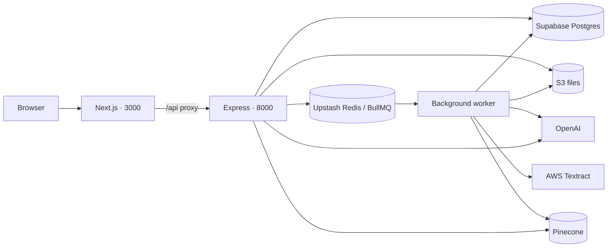

# Docura

Docura turns documents and recorded conversations into summaries, next steps, timelines, and answers linked to their sources. The idea is simple: understand what matters, see what is missing, and check the original evidence in one workspace.

## What it does

- Accepts PDF, Word (`.doc`, `.docx`), CSV, and audio (`.mp3`, `.m4a`, `.wav`, `.webm`). The default upload limit is 20 MB.
- Produces an overview with key points, requirements, missing or pending items, and a timeline shown newest first.
- Shows original PDFs, extracted passages, or a searchable audio transcript with speaker turns and playback timestamps.
- Lets you confirm speaker names and download the transcript.
- Saves each document's chat, including answers and citations, so it survives refreshes and document switching. Messages support Markdown, copying, and timestamps.

## Run locally

Install Docker, then create `server/.env` using [server/.env.example](server/.env.example). Fill in the credentials for Supabase, Upstash Redis, AWS, OpenAI, and Pinecone. The Pinecone index dimensions must match `OPENAI_EMBEDDING_DIMENSIONS` (1536 by default).

```sh
docker compose up -d --build
```

Open **[localhost:3000](http://localhost:3000)**. The Express API runs on **[localhost:8000](http://localhost:8000/api/health)**.

```sh
docker compose logs -f api worker  # Follow processing logs
docker compose down              # Stop the app
```

Compose runs the client, API, worker, and a one-time database migration. The migration container exiting successfully is expected. Postgres and Redis are hosted services, so Compose does not start local copies. Stopping the containers keeps uploaded files and saved conversations in those services.

For development with hot reload, follow the [server](server/README.md) and [client](client/README.md) instructions; run the API, worker, and client in separate terminals.

For AWS hosting at **docura.kevinnn.xyz**, follow the [Caddy deployment guide](docs/aws-caddy.md) for DNS, HTTPS, and server setup.

## Architecture



| Part                             | Responsibility                                                                                                            |
| -------------------------------- | ------------------------------------------------------------------------------------------------------------------------- |
| Next.js client · port 3000       | Workspace UI, uploads, previews, and chat. Proxies API requests to Express.                                               |
| Express API · port 8000          | Validates requests, checks workspace ownership, saves uploads, queues processing, and answers chat questions.             |
| Background worker · no HTTP port | Extracts or transcribes files, creates embeddings, and generates overviews. Keeps slow processing out of upload requests. |

**Storage has distinct roles:** S3 holds original files; Postgres holds document records, extracted passages, transcripts, processing events, and conversations; Redis holds processing jobs; Pinecone holds embeddings for searching relevant passages.

The client uses React, TanStack Query, Tailwind CSS v4, Hugeicons, and beUI components. The server runs on Bun with Express and Prisma. TanStack Query caches server data and polls while processing or answers are pending.

## How a file becomes an answer

1. **Upload:** Express validates the file, saves the original to S3, creates a document in Postgres, and queues its ID in BullMQ. The browser receives a queued status immediately after these steps.
2. **Extract:** The worker reads PDF text, uses Textract for scanned PDFs, extracts Word sections, or parses CSV rows. Audio goes through speech-to-text with speaker labels and timestamps.
3. **Process:** Text is split into passages that retain their source locations. OpenAI creates embeddings, Pinecone stores them, and OpenAI generates a structured overview. Long files are summarized in sections and then combined.
4. **Explore:** The UI polls until the document is ready. Citations open the corresponding passage, PDF page, or audio segment.
5. **Ask:** Express saves the question and gathers source text. Short documents use all extracted text; longer ones use vector search plus passages referenced by the overview, within a context limit. Recent conversation turns provide follow-up context. OpenAI returns an answer whose citation references are validated, then the answer is saved in Postgres.

Processing stages are `queued → started → extracted → parsed → chunked → embedded → stored`. Failed jobs get up to three automatic attempts with backoff, and the UI supports manual retry. The API also checks for unfinished jobs periodically.

Audio uses `gpt-4o-transcribe-diarize` for timestamped speaker turns, then follows the same passage, overview, and chat flow. Speaker names are user-confirmed aliases; they do not change the original transcript. Current defaults for summaries/chat and embeddings are `gpt-5.6-sol` and `text-embedding-3-small`, configured in [server/src/config/env.ts](server/src/config/env.ts).

## Code and data organization

The server follows **routes → services → adapters**. Routes handle HTTP and validation; services contain upload, processing, and chat logic; adapters connect to the database and external services. [server/src/container.ts](server/src/container.ts) connects these implementations. This keeps provider-specific code separate from application logic.

[shared/contracts.ts](shared/contracts.ts) defines the API types shared by client and server. Client components handle presentation, while hooks manage queries and mutations.

The [Prisma schema](server/prisma/schema.prisma) has a simple ownership hierarchy: a `Workspace` owns `Document` records; each document has `DocumentChunk`, `ProcessingEvent`, and `DocumentChat` records. Its overview and audio transcript are stored as JSON.

There are currently no user accounts. A signed, HTTP-only browser cookie identifies the workspace. Saved data survives restarts, but clearing or losing that cookie creates a new workspace. Chat and source retrieval are scoped to the selected document and workspace. AI output remains reviewable through citations; it is not independently verified evidence.

## Code checks

From the project root:

```sh
bun install
bun run lint
bun run format:check
```

After installing each app's dependencies, run `bun run typecheck` in `server/` and `bun run build` in `client/`.
